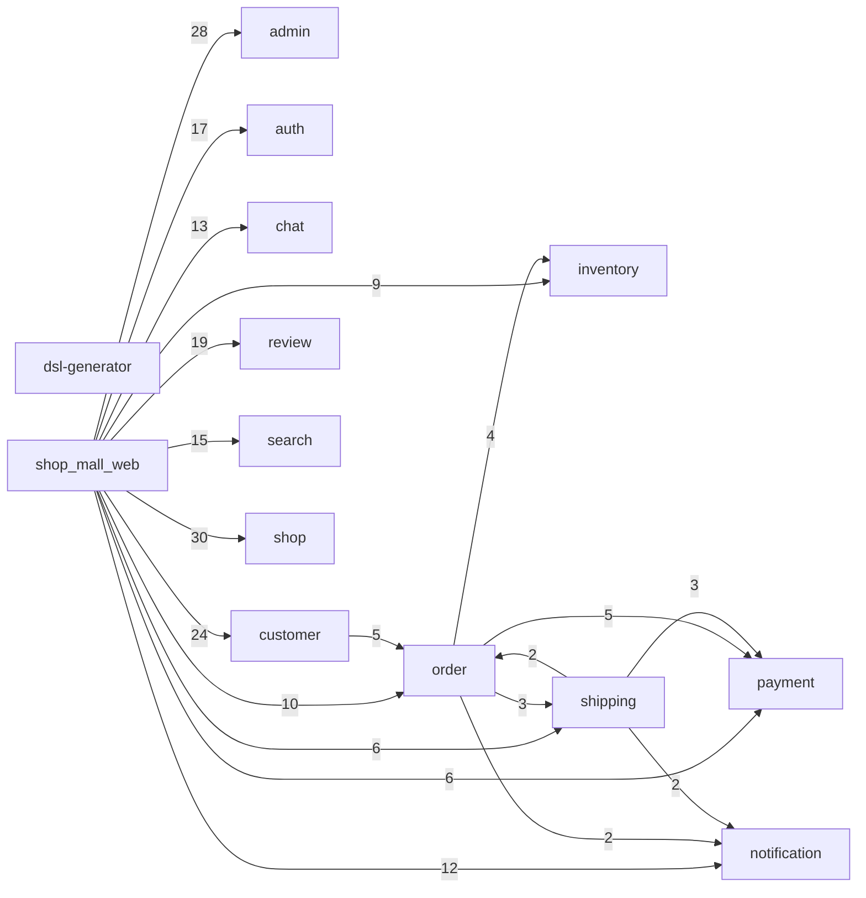

# go_microservice_example アーキテクチャレポート

> strata 0.1.0 により生成(2026-07-25T01:55:54.538Z)。
> 静的解析のため、メッセージキュー等の動的連携は含まれない。

## サービス間依存図

実線 = gRPC / API 依存、点線 = コード依存(import / call)。数字は依存数。

## サービス間の呼び出し詳細

| 呼び出し元 | 呼び出し先 | 使用している RPC |
|---|---|---|
| shop_mall_web | shop | ShopService.DeleteProduct, ShopService.ExportSalesData, ShopService.GetOrderDetail, ShopService.GetProduct, ShopService.GetSalesReport, ShopService.GetShop, ShopService.GetShopsByOwner, ShopService.ListOrders, ShopService.ListProducts, ShopService.ListShops, ShopService.ManageVariation, ShopService.RegisterProduct, ShopService.RegisterShop, ShopService.ToggleProductPublish, ShopService.ToggleShopPublish, ShopService.UpdateOrderStatus, ShopService.UpdateProduct, ShopService.UpdateShop, ShopService.UploadProductImage |
| shop_mall_web | admin | AdminService.ActivateShop, AdminService.ActivateUser, AdminService.AddForbiddenWord, AdminService.ApproveShop, AdminService.ChangeUserRole, AdminService.CreateCategory, AdminService.DeleteCategory, AdminService.DeleteForbiddenWord, AdminService.ExportAuditLogs, AdminService.ExportReport, AdminService.GenerateSalesReport, AdminService.GenerateUserReport, AdminService.GetAllShops, AdminService.GetAllUsers, AdminService.GetAuditLogs, AdminService.GetCategories, AdminService.GetDashboardMetrics, AdminService.GetForbiddenWords, AdminService.GetPendingShops, AdminService.GetSalesChart, AdminService.GetServiceHealth, AdminService.GetSystemSettings, AdminService.GetUserDetail, AdminService.RejectShop, AdminService.SuspendShop, AdminService.SuspendUser, AdminService.UpdateCategory, AdminService.UpdateSystemSetting |
| shop_mall_web | customer | CustomerService.AddToCart, CustomerService.AddToFavorite, CustomerService.DeleteAddress, CustomerService.DeletePaymentMethod, CustomerService.GetCart, CustomerService.GetFavorites, CustomerService.GetMyReviews, CustomerService.GetOrderDetail, CustomerService.GetOrderHistory, CustomerService.GetProfile, CustomerService.MergeGuestCart, CustomerService.PostReview, CustomerService.RegisterAddress, CustomerService.RegisterPaymentMethod, CustomerService.RemoveFromCart, CustomerService.RemoveFromFavorite, CustomerService.ReorderFromHistory, CustomerService.RequestOrderCancel, CustomerService.SearchPostalCode, CustomerService.UpdateAddress, CustomerService.UpdateCartItemQuantity, CustomerService.UpdateProfile, CustomerService.UpdateReview, CustomerService.UploadProfileImage |
| shop_mall_web | review | ReviewService.ApproveReview, ReviewService.DeleteReview, ReviewService.DeleteReviewByAdmin, ReviewService.DeleteShopReply, ReviewService.GetMyReviews, ReviewService.GetPendingReviews, ReviewService.GetProductRating, ReviewService.GetReviewDetail, ReviewService.GetReviewReports, ReviewService.GetReviewsByProduct, ReviewService.MarkReviewHelpful, ReviewService.PostReview, ReviewService.PostShopReply, ReviewService.RejectReview, ReviewService.ReportReview, ReviewService.ResolveReviewReport, ReviewService.UnmarkReviewHelpful, ReviewService.UpdateReview, ReviewService.UpdateShopReply |
| shop_mall_web | auth | AuthService.ChangePassword, AuthService.Login, AuthService.Logout, AuthService.RefreshToken, AuthService.Register, AuthService.RequestPasswordReset, AuthService.ResetPassword, AuthService.VerifyEmail, AuthService.VerifyToken, CustomerAuthService.RequestPasswordReset, CustomerAuthService.ResetPassword, CustomerAuthService.VerifyEmail, OwnerAuthService.RequestPasswordReset, OwnerAuthService.ResetPassword, OwnerAuthService.VerifyEmail |
| shop_mall_web | search | SearchService.ClearAllSearchHistory, SearchService.DeleteProductIndex, SearchService.DeleteSearchHistory, SearchService.DeleteShopIndex, SearchService.GetPopularKeywords, SearchService.GetSearchAnalytics, SearchService.GetSearchHistory, SearchService.GetSearchSuggestions, SearchService.GetTrendingKeywords, SearchService.IndexProduct, SearchService.IndexShop, SearchService.RecordSearchHistory, SearchService.SearchProducts, SearchService.SearchShops, SearchService.UpdateProductIndex |
| shop_mall_web | chat | ChatService.CreateChatRoom, ChatService.GetArchivedMessages, ChatService.GetChatRoomDetail, ChatService.GetChatRooms, ChatService.GetMessages, ChatService.GetUserPresence, ChatService.MarkMessagesAsRead, ChatService.SearchMessages, ChatService.SendMessage, ChatService.UpdatePresence, ChatService.UpdateRoomStatus, ChatService.UploadChatFile, ChatService.UploadChatImage |
| shop_mall_web | notification | NotificationService.CreateEmailTemplate, NotificationService.GetNotificationHistory, NotificationService.GetNotificationPreference, NotificationService.PreviewEmailTemplate, NotificationService.RefreshDeviceToken, NotificationService.RegisterDeviceToken, NotificationService.ResendNotification, NotificationService.SendBulkEmail, NotificationService.SendPushNotification, NotificationService.UnregisterDeviceToken, NotificationService.UpdateEmailTemplate, NotificationService.UpdateNotificationPreference |
| shop_mall_web | order | OrderService.CancelOrder, OrderService.CreateOrder, OrderService.CreateReorder, OrderService.ExportOrdersToCSV, OrderService.GetOrderDetail, OrderService.GetOrderStatistics, OrderService.GetOrderStatusHistory, OrderService.GetProductSalesRanking, OrderService.ListOrders, OrderService.SearchOrders |
| shop_mall_web | inventory | InventoryService.BulkGetInventory, InventoryService.CheckStockAlert, InventoryService.GetInventory, InventoryService.GetInventoryByProduct, InventoryService.GetInventoryHistory, InventoryService.GetStockTakingHistory, InventoryService.RecordStockTaking, InventoryService.RegisterInventory, InventoryService.UpdateInventoryQuantity |
| shop_mall_web | payment | PaymentService.ConfirmCODPayment, PaymentService.CreateRefund, PaymentService.GetPaymentDetail, PaymentService.GetPaymentStatus, PaymentService.GetRefundStatus, PaymentService.ListPayments |
| shop_mall_web | shipping | ShippingService.GetShipmentByOrder, ShippingService.GetShipmentDetail, ShippingService.NormalizeAddress, ShippingService.RegisterTrackingNumber, ShippingService.UpdateShipmentStatus, ShippingService.ValidateAddress |
| customer | order | OrderService.CancelOrder, OrderService.CreateReorder, OrderService.GetOrderDetail, OrderService.ListOrders |
| order | payment | PaymentService.ConfirmPayment, PaymentService.CreateCODPayment, PaymentService.CreatePaymentIntent, PaymentService.CreateRefund |
| order | inventory | InventoryService.BulkReserveStock, InventoryService.ConfirmStock, InventoryService.ReleaseStock |
| order | shipping | ShippingService.CalculateShippingFee, ShippingService.CreateShipment |
| shipping | payment | PaymentService.ConfirmCODPayment, PaymentService.ListPayments |
| order | notification | NotificationService.SendEmail |
| shipping | notification | NotificationService.SendEmail |
| shipping | order | OrderService.UpdateOrderStatus |

## サービス別サマリ

| サービス | 規模(LOC) | 公開RPC | 本番から呼ばれる | テストのみ | 未使用 |
|---|---:|---:|---:|---:|---:|
| shop_mall_web | 12,737 | 0 | 0 | 0 | 0 |
| auth | 5,916 | 24 | 15 | 9 | 0 |
| customer | 5,805 | 24 | 24 | 0 | 0 |
| shop | 5,573 | 19 | 19 | 0 | 0 |
| dsl-generator | 3,196 | 0 | 0 | 0 | 0 |
| order | 2,562 | 11 | 11 | 0 | 0 |
| payment | 2,332 | 9 | 9 | 0 | 0 |
| inventory | 2,117 | 14 | 13 | 0 | 1 |
| shipping | 1,981 | 9 | 9 | 0 | 0 |
| admin | 788 | 28 | 28 | 0 | 0 |
| review | 656 | 19 | 19 | 0 | 0 |
| notification | 583 | 13 | 13 | 0 | 0 |
| chat | 577 | 13 | 13 | 0 | 0 |
| search | 548 | 15 | 15 | 0 | 0 |

## 未使用の可能性がある API

本番コードからもテストからも呼び出しが見つからない RPC(棚卸し候補):

- **inventory**: InventoryService.ReserveStock

## 循環依存

- [(トップレベル)] order ⇄ shipping (5 edges)

