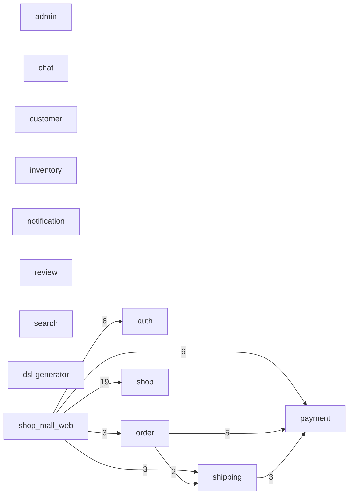

# go_microservice_example アーキテクチャレポート

> strata 0.1.0 により生成(2026-07-24T14:30:42.346Z)。
> 静的解析のため、メッセージキュー等の動的連携は含まれない。

## サービス間依存図

実線 = gRPC / API 依存、点線 = コード依存(import / call)。数字は依存数。

## サービス別サマリ

| サービス | 規模(LOC) | 公開RPC | 本番から呼ばれる | テストのみ | 未使用 |
|---|---:|---:|---:|---:|---:|
| shop_mall_web | 6,019 | 0 | 0 | 0 | 0 |
| auth | 5,858 | 24 | 4 | 9 | 11 |
| shop | 5,573 | 19 | 10 | 0 | 9 |
| customer | 5,180 | 24 | 0 | 0 | 24 |
| dsl-generator | 3,196 | 0 | 0 | 0 | 0 |
| payment | 2,088 | 9 | 9 | 0 | 0 |
| order | 1,941 | 11 | 3 | 0 | 8 |
| shipping | 1,342 | 9 | 4 | 1 | 4 |
| inventory | 1,230 | 14 | 0 | 0 | 14 |
| admin | 788 | 28 | 0 | 0 | 28 |
| review | 656 | 19 | 0 | 0 | 19 |
| notification | 583 | 13 | 0 | 0 | 13 |
| chat | 577 | 13 | 0 | 0 | 13 |
| search | 548 | 15 | 0 | 0 | 15 |

## 未使用の可能性がある API

本番コードからもテストからも呼び出しが見つからない RPC(棚卸し候補):

- **admin**: AdminService.ActivateShop, AdminService.ActivateUser, AdminService.AddForbiddenWord, AdminService.ApproveShop, AdminService.ChangeUserRole, AdminService.CreateCategory, AdminService.DeleteCategory, AdminService.DeleteForbiddenWord, AdminService.ExportAuditLogs, AdminService.ExportReport, AdminService.GenerateSalesReport, AdminService.GenerateUserReport, AdminService.GetAllShops, AdminService.GetAllUsers, AdminService.GetAuditLogs, AdminService.GetCategories, AdminService.GetDashboardMetrics, AdminService.GetForbiddenWords, AdminService.GetPendingShops, AdminService.GetSalesChart, AdminService.GetServiceHealth, AdminService.GetSystemSettings, AdminService.GetUserDetail, AdminService.RejectShop, AdminService.SuspendShop, AdminService.SuspendUser, AdminService.UpdateCategory, AdminService.UpdateSystemSetting
- **auth**: AuthService.ChangePassword, AuthService.Logout, AuthService.RefreshToken, AuthService.VerifyEmail, AuthService.VerifyToken, CustomerAuthService.RequestPasswordReset, CustomerAuthService.ResetPassword, CustomerAuthService.VerifyEmail, OwnerAuthService.RequestPasswordReset, OwnerAuthService.ResetPassword, OwnerAuthService.VerifyEmail
- **chat**: ChatService.CreateChatRoom, ChatService.GetArchivedMessages, ChatService.GetChatRoomDetail, ChatService.GetChatRooms, ChatService.GetMessages, ChatService.GetUserPresence, ChatService.MarkMessagesAsRead, ChatService.SearchMessages, ChatService.SendMessage, ChatService.UpdatePresence, ChatService.UpdateRoomStatus, ChatService.UploadChatFile, ChatService.UploadChatImage
- **customer**: CustomerService.AddToCart, CustomerService.AddToFavorite, CustomerService.DeleteAddress, CustomerService.DeletePaymentMethod, CustomerService.GetCart, CustomerService.GetFavorites, CustomerService.GetMyReviews, CustomerService.GetOrderDetail, CustomerService.GetOrderHistory, CustomerService.GetProfile, CustomerService.MergeGuestCart, CustomerService.PostReview, CustomerService.RegisterAddress, CustomerService.RegisterPaymentMethod, CustomerService.RemoveFromCart, CustomerService.RemoveFromFavorite, CustomerService.ReorderFromHistory, CustomerService.RequestOrderCancel, CustomerService.SearchPostalCode, CustomerService.UpdateAddress, CustomerService.UpdateCartItemQuantity, CustomerService.UpdateProfile, CustomerService.UpdateReview, CustomerService.UploadProfileImage
- **inventory**: InventoryService.BulkGetInventory, InventoryService.BulkReserveStock, InventoryService.CheckStockAlert, InventoryService.ConfirmStock, InventoryService.GetInventory, InventoryService.GetInventoryByProduct, InventoryService.GetInventoryHistory, InventoryService.GetStockTakingHistory, InventoryService.RecordStockTaking, InventoryService.RegisterInventory, InventoryService.ReleaseExpiredReservations, InventoryService.ReleaseStock, InventoryService.ReserveStock, InventoryService.UpdateInventoryQuantity
- **notification**: NotificationService.CreateEmailTemplate, NotificationService.GetNotificationHistory, NotificationService.GetNotificationPreference, NotificationService.PreviewEmailTemplate, NotificationService.RefreshDeviceToken, NotificationService.RegisterDeviceToken, NotificationService.ResendNotification, NotificationService.SendBulkEmail, NotificationService.SendEmail, NotificationService.SendPushNotification, NotificationService.UnregisterDeviceToken, NotificationService.UpdateEmailTemplate, NotificationService.UpdateNotificationPreference
- **order**: OrderService.CreateReorder, OrderService.ExportOrdersToCSV, OrderService.GetOrderDetail, OrderService.GetOrderStatistics, OrderService.GetOrderStatusHistory, OrderService.GetProductSalesRanking, OrderService.SearchOrders, OrderService.UpdateOrderStatus
- **review**: ReviewService.ApproveReview, ReviewService.DeleteReview, ReviewService.DeleteReviewByAdmin, ReviewService.DeleteShopReply, ReviewService.GetMyReviews, ReviewService.GetPendingReviews, ReviewService.GetProductRating, ReviewService.GetReviewDetail, ReviewService.GetReviewReports, ReviewService.GetReviewsByProduct, ReviewService.MarkReviewHelpful, ReviewService.PostReview, ReviewService.PostShopReply, ReviewService.RejectReview, ReviewService.ReportReview, ReviewService.ResolveReviewReport, ReviewService.UnmarkReviewHelpful, ReviewService.UpdateReview, ReviewService.UpdateShopReply
- **search**: SearchService.ClearAllSearchHistory, SearchService.DeleteProductIndex, SearchService.DeleteSearchHistory, SearchService.DeleteShopIndex, SearchService.GetPopularKeywords, SearchService.GetSearchAnalytics, SearchService.GetSearchHistory, SearchService.GetSearchSuggestions, SearchService.GetTrendingKeywords, SearchService.IndexProduct, SearchService.IndexShop, SearchService.RecordSearchHistory, SearchService.SearchProducts, SearchService.SearchShops, SearchService.UpdateProductIndex
- **shipping**: ShippingService.GetShipmentDetail, ShippingService.NormalizeAddress, ShippingService.SyncCarrierTracking, ShippingService.ValidateAddress
- **shop**: ShopService.ExportSalesData, ShopService.GetOrderDetail, ShopService.GetSalesReport, ShopService.GetShopsByOwner, ShopService.ManageVariation, ShopService.ToggleShopPublish, ShopService.UpdateOrderStatus, ShopService.UpdateShop, ShopService.UploadProductImage

## 循環依存

なし 🎉

