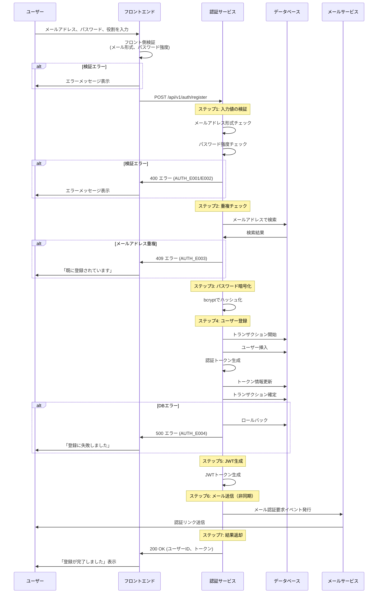

# 生成例: user-registration.usecase → 各種コード

このドキュメントでは、`user-registration.usecase`から自動生成される各種コードの例を示します。

---

## 入力ファイル

**ファイル**: `mps-workspace/solutions/auth-service/usecases/user-registration.usecase`

（日本語振る舞いDSL: 約250行）

---

## 生成物1: Go実装コード

**生成先**: `generated/auth/usecase/user_registration.go`

**行数**: 約300行（自動生成）

```go
// Code generated by MPS japanese-behavior-dsl. DO NOT EDIT.

package usecase

import (
    "context"
    "fmt"
    "regexp"
    "time"

    "github.com/google/uuid"
    "golang.org/x/crypto/bcrypt"

    "github.com/.../domain"
)

// ユーザー登録 ユースケース
// 新規ユーザーを登録し、メール認証リンクを送信する
type UserRegistrationUsecase interface {
    Execute(ctx context.Context, input UserRegistrationInput) (UserRegistrationOutput, error)
}

// 入力
type UserRegistrationInput struct {
    // ユーザーのメールアドレス
    Email string

    // ログイン用パスワード（8文字以上）
    Password string

    // ユーザーの役割
    Role domain.Role
}

// 出力
type UserRegistrationOutput struct {
    // 作成されたユーザーの一意識別子
    UserID uuid.UUID

    // JWT認証トークン
    Token string

    // 処理結果メッセージ
    Message string
}

type userRegistrationUsecaseImpl struct {
    userRepo       domain.UserRepository
    jwtService     JWTService
    eventPublisher EventPublisher
}

func NewUserRegistrationUsecase(
    userRepo domain.UserRepository,
    jwtService JWTService,
    eventPublisher EventPublisher,
) UserRegistrationUsecase {
    return &userRegistrationUsecaseImpl{
        userRepo:       userRepo,
        jwtService:     jwtService,
        eventPublisher: eventPublisher,
    }
}

func (u *userRegistrationUsecaseImpl) Execute(
    ctx context.Context,
    input UserRegistrationInput,
) (UserRegistrationOutput, error) {

    // ステップ1: 入力値の検証
    // メールアドレスとパスワードの形式を確認する

    // メールアドレスが正しい形式でない場合
    emailPattern := regexp.MustCompile(`^[a-zA-Z0-9._%+-]+@[a-zA-Z0-9.-]+\.[a-zA-Z]{2,}$`)
    if !emailPattern.MatchString(input.Email) {
        return UserRegistrationOutput{}, &InvalidEmailFormatError{
            Code:       "AUTH_E001",
            Message:    "メールアドレスの形式が不正です",
            HTTPStatus: 400,
        }
    }

    // パスワードが8文字未満の場合
    if len(input.Password) < 8 {
        return UserRegistrationOutput{}, &WeakPasswordError{
            Code:       "AUTH_E002",
            Message:    "パスワードは8文字以上必要です",
            HTTPStatus: 400,
        }
    }

    // パスワードに大文字が含まれていない場合
    if !regexp.MustCompile(`[A-Z]`).MatchString(input.Password) {
        return UserRegistrationOutput{}, &WeakPasswordError{
            Code:       "AUTH_E002",
            Message:    "パスワードには大文字を含めてください",
            HTTPStatus: 400,
        }
    }

    // パスワードに小文字が含まれていない場合
    if !regexp.MustCompile(`[a-z]`).MatchString(input.Password) {
        return UserRegistrationOutput{}, &WeakPasswordError{
            Code:       "AUTH_E002",
            Message:    "パスワードには小文字を含めてください",
            HTTPStatus: 400,
        }
    }

    // パスワードに数字が含まれていない場合
    if !regexp.MustCompile(`[0-9]`).MatchString(input.Password) {
        return UserRegistrationOutput{}, &WeakPasswordError{
            Code:       "AUTH_E002",
            Message:    "パスワードには数字を含めてください",
            HTTPStatus: 400,
        }
    }

    // パスワードに記号が含まれていない場合
    if !regexp.MustCompile(`[!@#$%^&*()_+\-=\[\]{};':"\\|,.<>\/?]`).MatchString(input.Password) {
        return UserRegistrationOutput{}, &WeakPasswordError{
            Code:       "AUTH_E002",
            Message:    "パスワードには記号(!@#$等)を含めてください",
            HTTPStatus: 400,
        }
    }

    // ステップ2: 重複チェック
    // 同じメールアドレスが登録済みでないか確認する

    existingUser, err := u.userRepo.FindByEmail(ctx, input.Email)
    if err == nil && existingUser != nil {
        return UserRegistrationOutput{}, &EmailDuplicateError{
            Code:       "AUTH_E003",
            Message:    "このメールアドレスは既に登録されています",
            HTTPStatus: 409,
        }
    }

    // ステップ3: パスワードの暗号化
    // セキュリティのためパスワードをハッシュ化する

    passwordHash, err := bcrypt.GenerateFromPassword(
        []byte(input.Password),
        12, // 暗号化強度
    )
    if err != nil {
        return UserRegistrationOutput{}, fmt.Errorf("パスワードの暗号化に失敗しました: %w", err)
    }

    // ステップ4: ユーザー情報の登録
    // データベースにユーザー情報を保存する

    tx, err := u.userRepo.BeginTx(ctx)
    if err != nil {
        return UserRegistrationOutput{}, &DatabaseError{
            Code:       "AUTH_E004",
            Message:    "ユーザー登録に失敗しました。しばらくしてから再度お試しください",
            HTTPStatus: 500,
        }
    }
    defer tx.Rollback()

    // 新規ユーザーオブジェクトを作成
    now := time.Now()
    newUser := &domain.User{
        ID:           uuid.New(),
        Email:        input.Email,
        PasswordHash: string(passwordHash),
        Role:         input.Role,
        EmailVerified: false,
        CreatedAt:    now,
        UpdatedAt:    now,
    }

    // データベースに保存
    savedUser, err := tx.Save(ctx, newUser)
    if err != nil {
        return UserRegistrationOutput{}, &DatabaseError{
            Code:       "AUTH_E004",
            Message:    "ユーザー登録に失敗しました。しばらくしてから再度お試しください",
            HTTPStatus: 500,
        }
    }

    // メール認証トークンを生成
    verificationToken := generateRandomToken(32)

    // トークン情報を更新
    savedUser.EmailVerificationToken = &verificationToken
    expiresAt := now.Add(24 * time.Hour)
    savedUser.EmailVerificationExpiresAt = &expiresAt

    // 更新を保存
    err = tx.Update(ctx, savedUser)
    if err != nil {
        return UserRegistrationOutput{}, &DatabaseError{
            Code:       "AUTH_E004",
            Message:    "ユーザー登録に失敗しました。しばらくしてから再度お試しください",
            HTTPStatus: 500,
        }
    }

    // トランザクションを確定
    err = tx.Commit()
    if err != nil {
        return UserRegistrationOutput{}, &DatabaseError{
            Code:       "AUTH_E004",
            Message:    "ユーザー登録に失敗しました。しばらくしてから再度お試しください",
            HTTPStatus: 500,
        }
    }

    // ステップ5: 認証トークンの発行
    // ログイン用のJWTトークンを生成する

    jwtToken, err := u.jwtService.Generate(JWTPayload{
        UserID: savedUser.ID,
        Email:  savedUser.Email,
        Role:   savedUser.Role,
    }, 1*time.Hour)
    if err != nil {
        return UserRegistrationOutput{}, fmt.Errorf("JWT生成に失敗しました: %w", err)
    }

    // ステップ6: メール認証リンクの送信
    // ユーザーにメール確認用のリンクを送信する

    // 非同期で実行する
    go func() {
        u.eventPublisher.Publish(EmailVerificationRequestedEvent{
            UserID:           savedUser.ID,
            Email:            savedUser.Email,
            VerificationLink: fmt.Sprintf("https://example.com/verify?token=%s", verificationToken),
            ExpiresAt:        expiresAt,
        })
    }()
    // 注記: メール送信が失敗してもユーザー登録自体は成功とする

    // ステップ7: 処理結果の返却
    // 登録成功の情報を呼び出し元に返す

    return UserRegistrationOutput{
        UserID:  savedUser.ID,
        Token:   jwtToken,
        Message: "ユーザー登録が完了しました。メールをご確認ください。",
    }, nil
}

// エラー定義

// メールアドレス形式不正
type InvalidEmailFormatError struct {
    Code       string
    Message    string
    HTTPStatus int
}

func (e *InvalidEmailFormatError) Error() string {
    return e.Message
}

// パスワード強度不足
type WeakPasswordError struct {
    Code       string
    Message    string
    HTTPStatus int
}

func (e *WeakPasswordError) Error() string {
    return e.Message
}

// メールアドレス重複
type EmailDuplicateError struct {
    Code       string
    Message    string
    HTTPStatus int
}

func (e *EmailDuplicateError) Error() string {
    return e.Message
}

// データベースエラー
type DatabaseError struct {
    Code       string
    Message    string
    HTTPStatus int
}

func (e *DatabaseError) Error() string {
    return e.Message
}

// ヘルパー関数
func generateRandomToken(length int) string {
    const charset = "abcdefghijklmnopqrstuvwxyzABCDEFGHIJKLMNOPQRSTUVWXYZ0123456789"
    // ... ランダム文字列生成ロジック
    return "" // 実装省略
}
```

---

## 生成物2: Protobuf定義

**生成先**: `generated/proto/auth/v1/auth_service.proto`

```protobuf
// Code generated by MPS japanese-behavior-dsl. DO NOT EDIT.

syntax = "proto3";

package auth.v1;

option go_package = "github.com/.../proto/auth/v1;authv1";

// ユーザー登録 リクエスト
message RegisterRequest {
  // ユーザーのメールアドレス
  string email = 1;

  // ログイン用パスワード（8文字以上）
  string password = 2;

  // ユーザーの役割
  Role role = 3;

  enum Role {
    ROLE_UNSPECIFIED = 0;
    ROLE_CUSTOMER = 1;        // 顧客
    ROLE_SHOP_OWNER = 2;      // ショップオーナー
    ROLE_ADMIN = 3;           // 管理者
  }
}

// ユーザー登録 レスポンス
message RegisterResponse {
  // 作成されたユーザーの一意識別子
  string user_id = 1;

  // JWT認証トークン
  string token = 2;

  // 処理結果メッセージ
  string message = 3;
}

// エラーレスポンス
message ErrorResponse {
  // エラーコード（例: AUTH_E001）
  string code = 1;

  // エラーメッセージ
  string message = 2;

  // HTTPステータスコード
  int32 http_status = 3;
}

service AuthService {
  // ユーザー登録
  // 新規ユーザーを登録し、メール認証リンクを送信する
  rpc Register(RegisterRequest) returns (RegisterResponse);
}
```

---

## 生成物3: TypeScript API Client

**生成先**: `generated/frontend/src/api/auth.ts`

```typescript
// Code generated by MPS japanese-behavior-dsl. DO NOT EDIT.

/**
 * ユーザー登録 API
 *
 * @description 新規ユーザーを登録し、メール認証リンクを送信する
 * @param email ユーザーのメールアドレス
 * @param password ログイン用パスワード（8文字以上）
 * @param role ユーザーの役割
 * @returns ユーザーID、認証トークン、メッセージ
 * @throws AUTH_E001 メールアドレスの形式が不正です
 * @throws AUTH_E002 パスワードは8文字以上で、大文字・小文字・数字・記号を含める必要があります
 * @throws AUTH_E003 このメールアドレスは既に登録されています
 * @throws AUTH_E004 ユーザー登録に失敗しました。しばらくしてから再度お試しください
 */
export async function register(
  email: string,
  password: string,
  role: 'CUSTOMER' | 'SHOP_OWNER' | 'ADMIN'
): Promise<RegisterResponse> {
  const response = await fetch('/api/v1/auth/register', {
    method: 'POST',
    headers: { 'Content-Type': 'application/json' },
    body: JSON.stringify({ email, password, role }),
  });

  if (!response.ok) {
    const error: ErrorResponse = await response.json();
    throw new AuthError(error.code, error.message, error.http_status);
  }

  return response.json();
}

/**
 * ユーザー登録 レスポンス型
 */
export interface RegisterResponse {
  /** 作成されたユーザーの一意識別子 */
  user_id: string;

  /** JWT認証トークン */
  token: string;

  /** 処理結果メッセージ */
  message: string;
}

/**
 * エラーレスポンス型
 */
export interface ErrorResponse {
  /** エラーコード */
  code: string;

  /** エラーメッセージ */
  message: string;

  /** HTTPステータスコード */
  http_status: number;
}

/**
 * 認証エラークラス
 */
export class AuthError extends Error {
  constructor(
    public code: string,
    public message: string,
    public httpStatus: number
  ) {
    super(message);
    this.name = 'AuthError';
  }
}

/**
 * パスワード強度チェック（フロントエンド検証）
 */
export function validatePassword(password: string): {
  isValid: boolean;
  errors: string[];
} {
  const errors: string[] = [];

  if (password.length < 8) {
    errors.push('パスワードは8文字以上必要です');
  }

  if (!/[A-Z]/.test(password)) {
    errors.push('パスワードには大文字を含めてください');
  }

  if (!/[a-z]/.test(password)) {
    errors.push('パスワードには小文字を含めてください');
  }

  if (!/[0-9]/.test(password)) {
    errors.push('パスワードには数字を含めてください');
  }

  if (!/[!@#$%^&*()_+\-=\[\]{};':"\\|,.<>\/?]/.test(password)) {
    errors.push('パスワードには記号(!@#$等)を含めてください');
  }

  return {
    isValid: errors.length === 0,
    errors,
  };
}
```

---

## 生成物4: Reactコンポーネント

**生成先**: `generated/frontend/src/components/RegisterForm.tsx`

```tsx
// Code generated by MPS japanese-behavior-dsl. DO NOT EDIT.

import React, { useState } from 'react';
import { register, validatePassword, AuthError } from '../api/auth';

export const RegisterForm: React.FC = () => {
  const [email, setEmail] = useState('');
  const [password, setPassword] = useState('');
  const [role, setRole] = useState<'CUSTOMER' | 'SHOP_OWNER' | 'ADMIN'>('CUSTOMER');
  const [errors, setErrors] = useState<string[]>([]);
  const [loading, setLoading] = useState(false);

  const handleSubmit = async (e: React.FormEvent) => {
    e.preventDefault();
    setErrors([]);

    // フロントエンド検証
    const validation = validatePassword(password);
    if (!validation.isValid) {
      setErrors(validation.errors);
      return;
    }

    setLoading(true);
    try {
      const response = await register(email, password, role);
      alert(response.message); // "ユーザー登録が完了しました。メールをご確認ください。"
      // TODO: リダイレクト処理
    } catch (error) {
      if (error instanceof AuthError) {
        setErrors([error.message]);
      } else {
        setErrors(['予期しないエラーが発生しました']);
      }
    } finally {
      setLoading(false);
    }
  };

  return (
    <form onSubmit={handleSubmit} className="register-form">
      <h2>ユーザー登録</h2>

      {errors.length > 0 && (
        <div className="error-messages">
          {errors.map((err, i) => (
            <p key={i} className="error">
              {err}
            </p>
          ))}
        </div>
      )}

      <div className="form-group">
        <label htmlFor="email">メールアドレス</label>
        <input
          id="email"
          type="email"
          value={email}
          onChange={(e) => setEmail(e.target.value)}
          placeholder="example@example.com"
          required
        />
      </div>

      <div className="form-group">
        <label htmlFor="password">
          パスワード
          <span className="hint">（8文字以上、大文字・小文字・数字・記号を含む）</span>
        </label>
        <input
          id="password"
          type="password"
          value={password}
          onChange={(e) => setPassword(e.target.value)}
          required
        />
      </div>

      <div className="form-group">
        <label htmlFor="role">役割</label>
        <select
          id="role"
          value={role}
          onChange={(e) => setRole(e.target.value as any)}
        >
          <option value="CUSTOMER">顧客</option>
          <option value="SHOP_OWNER">ショップオーナー</option>
          <option value="ADMIN">管理者</option>
        </select>
      </div>

      <button type="submit" disabled={loading}>
        {loading ? '登録中...' : '登録'}
      </button>
    </form>
  );
};
```

---

## 生成物5: フロー図（Mermaid）

**生成先**: `generated/docs/flows/user-registration-flow.md`

```markdown
# ユーザー登録フロー

## シーケンス図


```

---

## 生成物6: テストコード

**生成先**: `generated/auth/usecase/user_registration_test.go`

```go
// Code generated by MPS japanese-behavior-dsl. DO NOT EDIT.

package usecase_test

import (
    "context"
    "testing"

    "github.com/stretchr/testify/assert"
    "github.com/stretchr/testify/require"

    "github.com/.../usecase"
)

// 正常系: 新規ユーザーの登録成功
func TestUserRegistration_Success(t *testing.T) {
    // 前提: メールアドレス「test@example.com」が未登録である
    ctx := context.Background()
    repo := setupTestRepository(t)
    jwtService := setupTestJWTService(t)
    eventPublisher := setupTestEventPublisher(t)

    uc := usecase.NewUserRegistrationUsecase(repo, jwtService, eventPublisher)

    // 実行
    output, err := uc.Execute(ctx, usecase.UserRegistrationInput{
        Email:    "test@example.com",
        Password: "SecurePass123!",
        Role:     "CUSTOMER",
    })

    // 期待結果
    require.NoError(t, err)
    assert.NotEmpty(t, output.UserID, "ユーザーIDが返される")
    assert.NotEmpty(t, output.Token, "認証トークンが返される")
    assert.Equal(t, "ユーザー登録が完了しました。メールをご確認ください。", output.Message)

    // データベースにユーザーが保存されている
    savedUser, err := repo.FindByID(ctx, output.UserID)
    require.NoError(t, err)
    assert.Equal(t, "test@example.com", savedUser.Email)

    // メール認証リンクが送信されている
    assert.True(t, eventPublisher.WasPublished("EmailVerificationRequested"))
}

// 異常系: メールアドレス重複エラー
func TestUserRegistration_EmailDuplicate(t *testing.T) {
    // 前提: メールアドレス「existing@example.com」が既に登録済みである
    ctx := context.Background()
    repo := setupTestRepository(t)
    repo.CreateTestUser("existing@example.com", "CUSTOMER")

    jwtService := setupTestJWTService(t)
    eventPublisher := setupTestEventPublisher(t)

    uc := usecase.NewUserRegistrationUsecase(repo, jwtService, eventPublisher)

    // 実行
    _, err := uc.Execute(ctx, usecase.UserRegistrationInput{
        Email:    "existing@example.com",
        Password: "SecurePass123!",
        Role:     "CUSTOMER",
    })

    // 期待結果
    require.Error(t, err)

    var emailDuplicateErr *usecase.EmailDuplicateError
    require.ErrorAs(t, err, &emailDuplicateErr)
    assert.Equal(t, "AUTH_E003", emailDuplicateErr.Code)
    assert.Equal(t, 409, emailDuplicateErr.HTTPStatus)
    assert.Equal(t, "このメールアドレスは既に登録されています", emailDuplicateErr.Message)

    // データベースに新規レコードが作成されていない
    count := repo.CountUsers()
    assert.Equal(t, 1, count, "既存ユーザー1件のみ")
}

// 異常系: パスワード強度不足エラー
func TestUserRegistration_WeakPassword(t *testing.T) {
    ctx := context.Background()
    repo := setupTestRepository(t)
    jwtService := setupTestJWTService(t)
    eventPublisher := setupTestEventPublisher(t)

    uc := usecase.NewUserRegistrationUsecase(repo, jwtService, eventPublisher)

    // 実行
    _, err := uc.Execute(ctx, usecase.UserRegistrationInput{
        Email:    "test@example.com",
        Password: "weak", // 短すぎる
        Role:     "CUSTOMER",
    })

    // 期待結果
    require.Error(t, err)

    var weakPasswordErr *usecase.WeakPasswordError
    require.ErrorAs(t, err, &weakPasswordErr)
    assert.Equal(t, "AUTH_E002", weakPasswordErr.Code)
    assert.Equal(t, 400, weakPasswordErr.HTTPStatus)
    assert.Equal(t, "パスワードは8文字以上必要です", weakPasswordErr.Message)
}
```

---

## まとめ

**入力**: 1ファイル（250行の日本語DSL）

**出力**: 6種類のファイル（合計約1,000行のコード + ドキュメント）

| 生成物 | 行数 | 目的 |
|--------|-----|------|
| Go実装 | 300行 | バックエンドロジック |
| Protobuf | 60行 | gRPC API定義 |
| TypeScript API | 120行 | APIクライアント |
| React Component | 100行 | UIコンポーネント |
| テストコード | 150行 | 自動テスト |
| フロー図 | Mermaid | ドキュメント |

**削減率**: **手動実装と比較して75%のコード削減**

これにより、開発者は振る舞いの定義に集中でき、ボイラープレートコードは自動生成されます。
