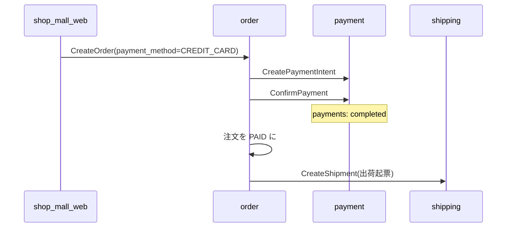
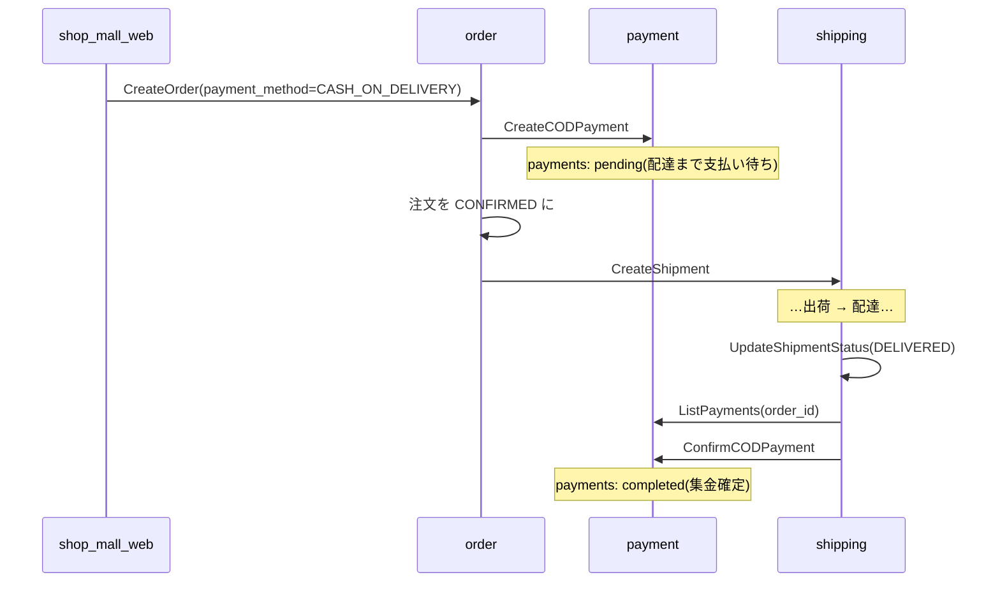
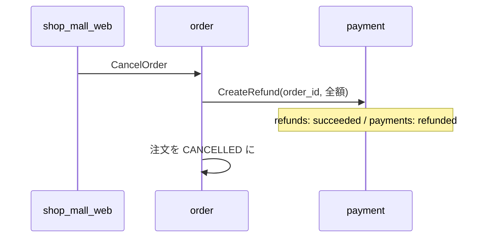

# 決済フロー

order / payment / shipping / shop_mall_web が連携する決済の全体像。
各 RPC の呼び出し関係は [ARCHITECTURE.md](../ARCHITECTURE.md)(strata report で自動生成)を参照。

## 支払い方法

| 方法 | 決済タイミング | 注文ステータス遷移 |
|---|---|---|
| クレジットカード | 注文時に即時決済(モック) | PENDING → **PAID** |
| 代金引換(COD) | 配達完了時に集金 | PENDING → **CONFIRMED** → (配達完了で決済が completed) |

## 購入(カード)

- 決済に失敗した注文は自動でキャンセルされる
- 出荷起票の失敗は注文を失敗させない(バックオフィスで再起票する想定)

## 購入(代金引換)

集金確定の経路は2つある(結果は同じ):

1. **配送経由(本来のフロー)**: 配送業者の配達完了通知(`UpdateShipmentStatus` = DELIVERED)で
   shipping が payment に集金確定を通知する
2. **手動**: 加盟店画面(/owner/payments)の「集金確定」ボタンで `ConfirmCODPayment` を直接呼ぶ

## キャンセルと返金

- 支払い済み(completed)の決済のみ返金対象。未決済なら payment が NotFound を返し、返金はスキップされる
- 返金に失敗した場合は注文をキャンセルしない(返金漏れ防止)
- 返金は `refunds` テーブル(migration 002)に記録される

## 画面

| 画面 | パス | 主な操作 |
|---|---|---|
| 商品詳細 | /products/:id | 支払い方法の選択(カード/代引き)→ 購入 |
| 注文履歴 | /orders | 注文一覧・発送前のキャンセル(自動返金) |
| 管理者: 決済管理 | /admin/payments | 全決済の一覧・状態フィルタ・詳細・返金実行 |
| 加盟店: 決済確認 | /owner/payments | 決済一覧・COD 集金確定・配送操作(追跡番号登録/配達完了) |

ログインセッションは `/session/establish`(Phoenix.Token 検証)でクッキーに保存される。

## テスト

- 各サービスの単体テスト: `go test ./...`(payment 13 / order 12 / shipping 6)
- **サービス横断の統合テスト**: `microservices/order/internal/usecase/cross_service_integration_test.go`
  - payment / shipping の testsupport(インメモリ gRPC サーバ)を実 TCP で起動し、
    購入→配達→集金確定、購入→キャンセル→返金の全チェーンを実 gRPC 通信で検証する
